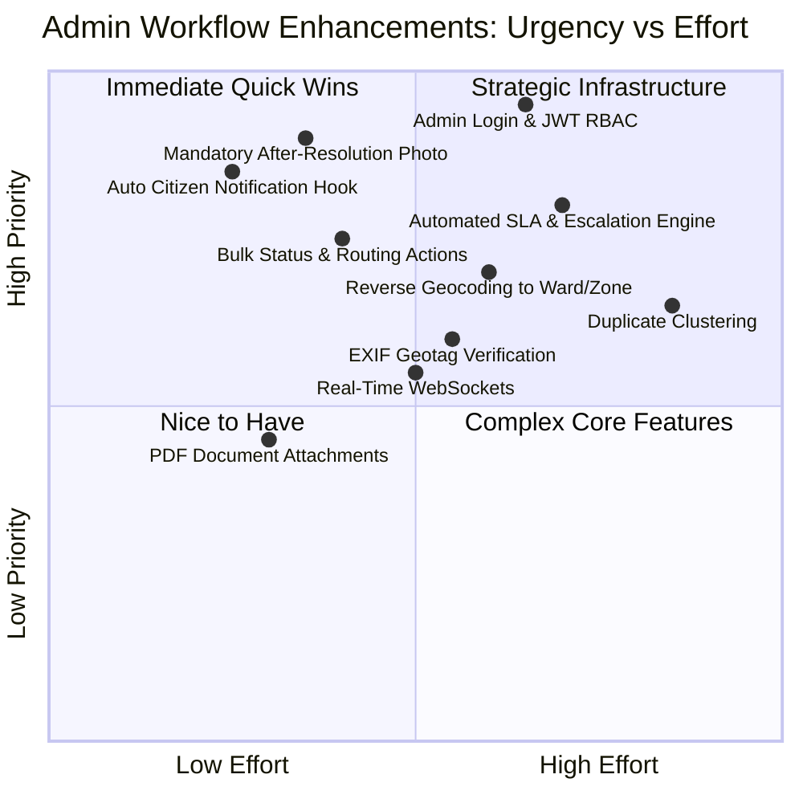

# Comprehensive Audit of Admin Workflow & Remaining Issues

**System:** Smart Civic Platform / CPGRAMS Civic Administration Portal  
**Document Type:** Technical Workflow Analysis & Backlog Specification  
**Portal Version:** 4.2.1-NIC (Admin Console)  
**Date of Audit:** September 2026  
**Audience:** Platform Architects, Backend Engineers, and Civic Administrative Officers  

---

## Executive Summary

The Administration Portal has been restructured to provide an authentic, high-contrast, institutional Indian Government portal experience (modeled after CPGRAMS, National Portal of India, and MoHUA municipal portals). Key workflow improvements were implemented on the frontend:
1. **Photographic Evidence Inspection**: Live thumbnail previews with count badges in the Grievance Register, coupled with an interactive high-resolution Lightbox (zoom in/out, 90° clockwise rotation for mobile-shot orientation corrections, and full-resolution evidence downloading).
2. **Integrated Grievance Dossier & Action Center**: Triage status progression, department routing, and direct official/engineer assignment consolidated into a unified modal with Next/Previous keyboard and click navigation for rapid case review.
3. **Official Docket Generation & CSV Export**: NIC-compliant docket numbers (`GRV-2026-XXXXX`), print-ready official grievance slips with emblem and seal blocks, and full CSV register exports.
4. **Pure English Localization**: Completely eliminated all bilingual/Devanagari scripts from all pages and components while retaining authoritative institutional structure and accessibility controls.

However, several deep administrative workflow enhancements require **backend schema updates, asynchronous services, and infrastructural integrations**. This document details all outstanding workflow bottlenecks and issues that remain to be resolved.

---

## 1. Authentication, Security & Administrative RBAC

| # | Workflow Bottleneck | Current State | Operational Risk / Impact | Recommended Solution |
|---|---------------------|---------------|---------------------------|----------------------|
| **1.1** | **Absence of Admin Authentication & Session Management** | The admin portal connects directly to backend REST endpoints without an authorization barrier or JWT verification. | Any client with network access to the admin frontend or port 8000 can perform CRUD operations, delete records, or reassign departments. | Implement OAuth2 / JWT bearer token authentication with an official Admin Login screen, multi-factor authentication (MFA/OTP), and secure HTTP-only session cookies. |
| **1.2** | **Lack of Granular Role-Based Access Control (RBAC)** | All administrative actions (e.g. deleting a grievance vs. viewing status) are unrestricted. | A junior zonal clerk has the same destructive permissions as an IAS Divisional Commissioner or Superintending Engineer. | Define permission scopes in backend and frontend: `admin:read`, `admin:assign`, `admin:update_status`, and `admin:delete` (restricted to Super Admins). |
| **1.3** | **Immutable Audit Log for Administrative Actions** | While `status_histories` tracks complaint status transitions, deletions of complaints, edits to user roles, and department modifications leave no audit footprint. | Inability to establish administrative accountability or non-repudiation during vigilance or RTI inquiries. | Create an `admin_audit_logs` table recording `admin_user_id`, `action`, `target_entity`, `ip_address`, `old_values`, `new_values`, and `timestamp`. |

---

## 2. Evidence & Photographic Inspection Pipeline

| # | Workflow Bottleneck | Current State | Operational Risk / Impact | Recommended Solution |
|---|---------------------|---------------|---------------------------|----------------------|
| **2.1** | **No "Before vs. After" Resolution Proof Upload** | When an officer marks a grievance as "Resolved", they can only provide textual remarks. No photographic completion proof is enforced. | Officials can close complaints without actual physical remediation (e.g., falsely claiming a pothole was filled). Citizens often reopen grievances due to false closure. | Enforce mandatory upload of **"Post-Remediation Verification Photographs"** before a complaint can transition to `Resolved` or `Closed`. Support side-by-side Before/After comparison in the admin dossier. |
| **2.2** | **Single Image Upload Limitation in Backend** | The mobile / citizen app currently submits one image URL during initial complaint creation; additional images must be manually injected into `complaint_images`. | Citizens cannot submit multiple angles of a hazard (e.g., wide road view + close-up depth shot) in one seamless submission. | Update `POST /complaints` schema to accept `image_urls: list[str]` or implement multi-part batch upload in `POST /upload`. |
| **2.3** | **Lack of Image Metadata & EXIF Geotag Verification** | Uploaded photos lose EXIF timestamp and GPS coordinates upon Supabase storage upload. | Admins cannot verify whether a photo was taken at the actual reported location or downloaded from the internet / recycled from past complaints. | Extract EXIF metadata (capture timestamp, GPS latitude/longitude) upon upload and flag any image whose EXIF coordinates deviate by >500 meters from reported location. |
| **2.4** | **No Support for Non-Image Supporting Documents** | The portal only supports images (`.jpg`, `.jpeg`, `.png`). | Citizens cannot attach official petitions, scanned municipal notices, RTI applications, or engineer PDF inspection reports. | Extend Supabase storage buckets and backend schemas to support `.pdf` and `.doc` attachments with in-browser PDF docket previews. |

---

## 3. SLA Tracking, Escalation & Automated Alerts

| # | Workflow Bottleneck | Current State | Operational Risk / Impact | Recommended Solution |
|---|---------------------|---------------|---------------------------|----------------------|
| **3.1** | **No Automated SLA Timer or Escalation Engine** | Priorities (`High`, `Medium`, `Low`) are passive labels. There is no automated countdown or timer tracking elapsed time against the Citizens' Charter SLA. | Overdue complaints remain unnoticed unless manually identified by an admin scanning tables. | Implement automated SLA rules (e.g., High = 48 hrs, Medium = 7 days, Low = 15 days). Display countdown clocks and "SLA Breached" alerts. Auto-escalate breaches to higher zonal officers. |
| **3.2** | **Disconnected Citizen Notification Triggers** | When an admin updates complaint status or assigns an officer, the backend does **not** automatically generate a record in `notifications` for the citizen. | Citizens are unaware of progress unless they manually open the app and poll the status, leading to repeated calls to civic helplines. | Add a database trigger or FastAPI event hook in `complaints_router` to automatically dispatch push notifications and SMS alerts to the citizen upon every status update. |
| **3.3** | **No Automated Geocoding & Ward Routing** | Complaints with only latitude and longitude require manual department assignment by the administrator. | Admin spends significant time looking up addresses on external maps to determine which municipal ward or zonal division handles the issue. | Integrate OpenStreetMap Nominatim or Google Geocoding API to auto-populate administrative ward, zone, and PIN code, and automatically route issues to the respective department. |

---

## 4. Bulk Triage & Operational Productivity

| # | Workflow Bottleneck | Current State | Operational Risk / Impact | Recommended Solution |
|---|---------------------|---------------|---------------------------|----------------------|
| **4.1** | **Absence of Bulk Batch Actions** | Admins must open each complaint individually to update status, forward to departments, or assign officers. | During monsoons or natural emergencies where 500+ water-logging issues are reported simultaneously, individual processing creates massive administrative backlogs. | Add checkbox selection to the Grievances table allowing **Batch Status Updates**, **Batch Department Forwarding**, and **Batch Export/Printing**. |
| **4.2** | **Duplicate Grievance Detection** | Multiple citizens frequently file complaints for the same prominent civic issue (e.g., a burst main water pipe or major traffic signal failure). Currently each complaint is treated as an isolated ticket. | Department engineers receive redundant work orders for the same physical location, fragmenting manpower. | Implement spatial-temporal clustering (e.g., grouping complaints with matching categories within a 100m radius filed within 48 hours) allowing admins to merge duplicates into a Master Grievance docket. |
| **4.3** | **Lack of Real-Time WebSocket Streaming** | The admin portal relies on manual page refreshes or periodic re-fetching to receive newly registered complaints. | Critical emergencies filed by citizens are delayed in reaching the administrator's attention. | Implement WebSocket channels (or Supabase Realtime subscriptions) on `/complaints` and `/dashboard` to dynamically push incoming grievances with audio/visual alerts. |

---

## 5. Summary Priority Matrix for Engineering Roadmap

---

## 6. Verification & Current Operational Status

The following admin portal features are fully verified, compiled with Next.js Turbopack, and active in the local production build:

1. **Dashboard (`/`)**: Executive statistics, SLA directive notification, status/priority breakdown charts, and direct dossier inspection.
2. **Public Grievances (`/complaints`)**:
   - Status triage tabs (`All`, `Pending Review`, `Assigned`, `Under Investigation`, `Disposed/Resolved`, `Urgent`).
   - Photographic evidence column with thumbnail count badges.
   - High-resolution Lightbox with zoom, rotate, and file download.
   - Grievance Dossier & Action Center with status update, field assignment, and printable official slip.
   - Full CSV export in official NIC register format.
3. **Field Work Orders (`/assignments`)**: Issue, track, and reassign official work orders linked to grievances.
4. **Municipal Departments (`/departments`)**: Manage municipal wings and monitor active complaint caseloads.
5. **Users & Officials (`/users`)**: Directory of authorized officers, engineers, and citizens.
6. **Citizen Feedback (`/feedback`)**: Citizen Redressal Satisfaction Index (GRSI) score and rating distribution.
7. **Official Notifications (`/notifications`)**: Broadcast directives and administrative alerts.
8. **Pure English & Official GIGW Style**: 100% English typography with Ashoka Emblem, national tricolor accents, and responsive layout.
